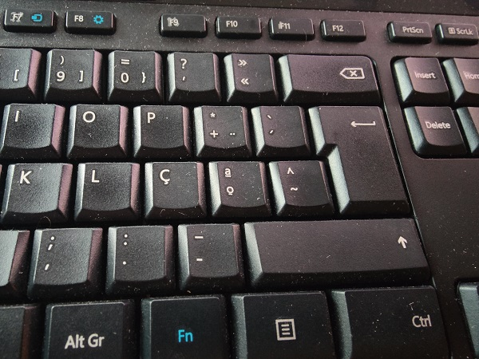
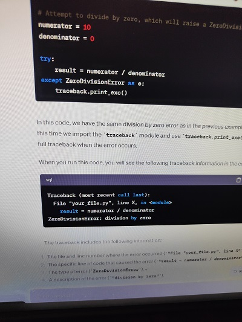
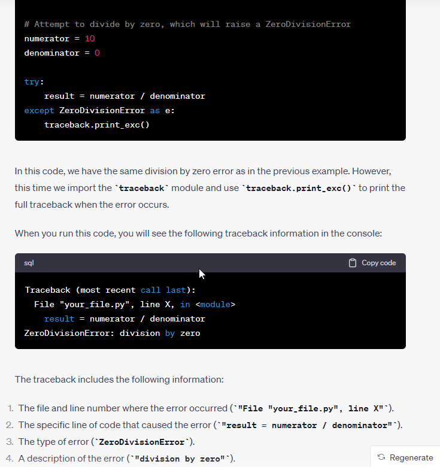
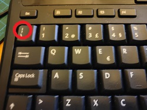

# Writing Good Documentation

## Step 1 - Using Codeblocks.

Codeblocks in markdown make it _very easy_ for tech people to **copy, paste, share** code.
A good Cloud Engineer uses Codeblocks whenever possible.

Because it allows others to copy and paste their code to replicate or research issues.


- In order to create codeblocks in markdown you need to use backticks (`)
- Not to be confused with qoutation (')

```
def factorial(n):
    if n == 0:
        return 1
    else:
        return n * factorial(n - 1)

# Test the factorial function
num = 5
result = factorial(num)
print(f"The factorial of {num} is {result}")
```

- When you can you should attempt to apply sintax highlighting to your codeblocks

```python
def factorial(n):
    if n == 0:
        return 1
    else:
        return n * factorial(n - 1)

# Test the factorial function
num = 5
result = factorial(num)
print(f"The factorial of {num} is {result}")
```

- Make note of where the backtick button is located in a portuguese keyboard. 
- In a US keyboard the backtick button is located above the tab key.



Good Cloud Engineers use codeblocks for both Code and Errors that appear in the console.


```bash
Traceback (most recent call last):
  File "your_file.py", line X, in <module>
    result = numerator / denominator
ZeroDivisionError: division by zero
```

> Here is an example of using a codeblock for an error that apperar in bash.

When you can always provide a codeblock instead of a screenshot.
If you need to take a screenshot make sure it is not a photo from your phone.

> There are certain cases where it's ok to take photos with your phone. This is when your are showing something like a keyboard, which does not appear on your computer screens. If it is render on your computer screen it should be a screenshot.

## Step 2 - How to take screenshots

A screenshot is when you capture a part of your screen from your laptop, desktop or phone.

This is not to be confused with take a photo with your phone.

**DON'T DO THIS**



This what a screenshot from your computer should look like

**DO THIS INSTEAD**



Taking a screenshot can be done using different methods depending on your operating system. Here are instructions for taking screenshots on some common operating systems:

**Windows:**

1. **Full Screen Screenshot:**
   - Press the `PrtScn` (Print Screen) key on your keyboard. This will capture the entire screen.
   - To save the screenshot, open an image editing program (e.g., Paint) and paste (`Ctrl + V`) the screenshot. Then, you can save the image.

2. **Screenshot of the Active Window:**
   - To capture only the active window, press `Alt + PrtScn`.
   - Paste (`Ctrl + V`) the screenshot into an image editing program and save it.

3. **Snipping Tool or Snip & Sketch:**
   - On Windows 10 and later versions, you can use the Snipping Tool or Snip & Sketch to capture custom areas of the screen. Search for these tools in the Start menu.

4. **Snip & Sketch Shortcut:**
   - On Windows 10, you can also use the `Windows + Shift + S` keyboard shortcut to open the Snip & Sketch tool and capture a specific area of the screen.

**macOS:**

1. **Full Screen Screenshot:**
   - Press `Shift + Command + 3` to capture the entire screen.
   - The screenshot will be saved to your desktop by default.

2. **Screenshot of a Selected Area:**
   - Press `Shift + Command + 4`. Your cursor will change to a crosshair.
   - Click and drag to select the area you want to capture.
   - The screenshot will be saved to your desktop.

**Linux (GNOME Desktop Environment):**

1. **Full Screen Screenshot:**
   - Press `PrtScn` to capture the entire screen.
   - The screenshot will typically be saved in your home directory or the Pictures folder.

2. **Screenshot of a Selected Area:**
   - Press `Shift + PrtScn` to capture a specific area of the screen.
   - Click and drag to select the area you want to capture.
   - The screenshot will typically be saved in your home directory or the Pictures folder.

These are the basic methods for taking screenshots on commonly used operating systems. Keep in mind that some systems or desktop environments may have additional tools or shortcuts for taking screenshots, so you might want to explore your specific setup for more options.

## Step 3 - Use Github Flavored Markdown Taks Lists

Github extends Markdown to have a list where you can check off items. [<sup>[1]</sup>](#external-references)

- [x] Finish Step 1
- [ ] Finish Step 2
- [x] Finish Step 3

## Step 4 - Use Emojis (Optional)

GitHub Flavored Markdown (GFM) supports.
Here are some examples:

| Name | Shortcode | Emoji |
| --- | --- | --- |
| Cloud | `:cloud:` | :cloud: |
| Cloud with lightning| `:cloud_with_lightning:` | :cloud_with_lightning: |

## Step 5 - How to create a table

You can use the following markdown format to create tables:

```md
| Name | Shortcode | Emoji |
| --- | --- | --- |
| Cloud | `:cloud:` | :cloud: |
| Cloud with lightning| `:cloud_with_lightning:` | :cloud_with_lightning: |
```

Github extends the funcionality of Markdown tables to provide more aligment and table cell formatting options. [<sup>[2]</sup>](#external-references)

- Make note of where the pipe character keyboard is located in a portuguese keyboard. 
- In a US keyboard the pipe character keyboard is located above the return or enter key.



[Secret Window Hidden Garden](secret-window/hidden-garden.md)

## External References

- [GitHub Flavored Markdown Spec](https://github.github.com/gfm/)
- [Basic writing and formatting syntax (GitHub Flavored Markdown)](https://docs.github.com/en/get-started/writing-on-github/getting-started-with-writing-and-formatting-on-github/basic-writing-and-formatting-syntax)
- [GFM - Task Lists](https://docs.github.com/en/get-started/writing-on-github/getting-started-with-writing-and-formatting-on-github/basic-writing-and-formatting-syntax#task-lists) <sup>[1]</sup>
- [GFM - Emoji CHeatSheet](https://github.com/ikatyang/emoji-cheat-sheet)
- [GFM - Tables (with extensions)](https://github.github.com/gfm/#tables-extension-) <sup>[2]</sup>
